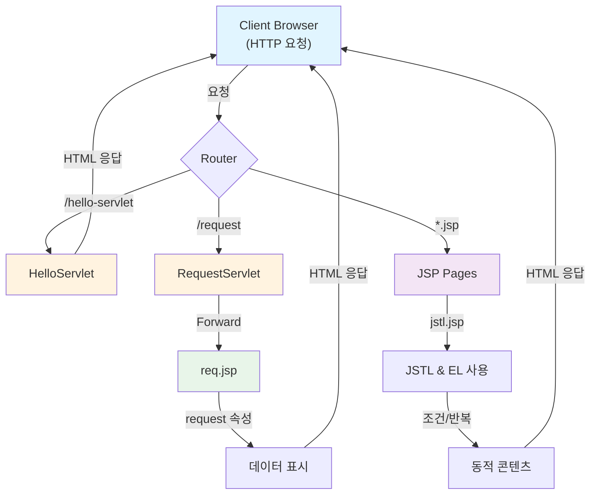
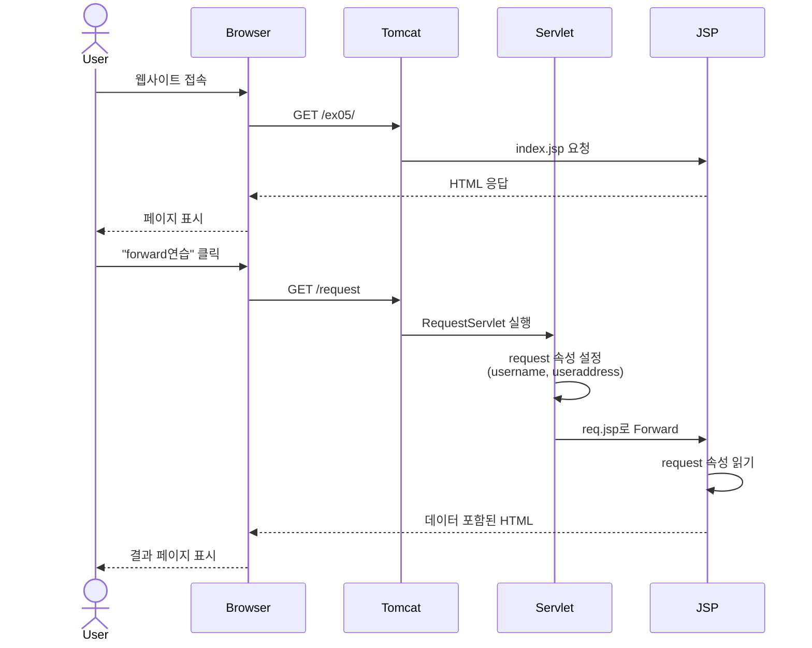

# 📚 ex05 - JSTL, EL & Forward를 활용한 동적 웹 애플리케이션

> JSTL(JSP Standard Tag Library), EL(Expression Language), Forward 기능을 학습하는 프로젝트

## 📋 프로젝트 개요

이 프로젝트는 JSP에서 **JSTL(JSP Standard Tag Library)**과 **EL(Expression Language)**를 활용하여 더욱 효율적이고 간결한 웹 애플리케이션을 개발하는 방법과, **Forward**를 통한 요청 처리 흐름을 학습합니다.

**주요 기술 스택:**
- ☕ **Java 100%**
- 🏷️ **JSTL**: JSP 표준 태그 라이브러리 (조건문, 반복문 등)
- 📝 **EL (Expression Language)**: 간결한 표현식 언어
- 🔄 **Forward**: 서버 내부에서 요청을 다른 페이지로 전달
- 📊 **동적 데이터 처리**: 서버에서 클라이언트로 데이터 전송

---

## 🏗️ 프로젝트 아키텍처



---

## 📁 프로젝트 구조

```
ex05/
├── .gitignore                          # Git 제외 파일 설정
├── build.gradle                        # Gradle 빌드 설정 파일
├── settings.gradle                     # Gradle 프로젝트 설정
├── gradlew                             # Gradle Wrapper (Linux/Mac)
├── gradlew.bat                         # Gradle Wrapper (Windows)
│
├── gradle/                             # Gradle 관련 파일
│   └── wrapper/                        # Gradle Wrapper 저장소
│
├── .idea/                              # IntelliJ IDEA 프로젝트 설정
│
└── src/main/
    ├── java/org/scoula/ex05/
    │   ├── HelloServlet.java                       # 기본 Servlet 예제
    │   └── RequestServlet.java                     # Forward 처리 Servlet
    │
    └── webapp/
        ├── index.jsp                               # 메인 페이지
        ├── jstl.jsp                                # JSTL & EL 예제
        ├── req.jsp                                 # Forward 결과 페이지
        │
        └── WEB-INF/
            └── web.xml                             # 웹 애플리케이션 설정
```

### 📊 디렉토리별 설명

| 디렉토리 | 설명 |
|---------|------|
| **src/main/java** | Java 소스 코드 저장소 |
| **src/main/java/org/scoula/ex05** | 프로젝트 패키지 (Servlet 클래스) |
| **src/main/webapp** | 웹 애플리케이션 리소스 (JSP 페이지) |
| **src/main/webapp/WEB-INF** | 웹 설정 파일 저장소 |

---

## 🔄 시스템 플로우



---

## 💻 핵심 코드

### 1️⃣ HelloServlet.java
기본적인 Servlet 예제입니다.

```java
import java.io.*;
import javax.servlet.http.*;
import javax.servlet.annotation.*;

@WebServlet(name = "helloServlet", value = "/hello-servlet")
public class HelloServlet extends HttpServlet {
    @Override
    protected void doGet(HttpServletRequest request, HttpServletResponse response)
            throws java.io.IOException {
        response.setContentType("text/html; charset=UTF-8");
        PrintWriter out = response.getWriter();
        out.println("<html><body>");
        out.println("<h1>Hello Servlet!</h1>");
        out.println("</body></html>");
    }
}
```

### 2️⃣ RequestServlet.java
Forward를 사용하여 요청을 다른 JSP 페이지로 전달하는 Servlet입니다.

```java
import java.io.IOException;
import javax.servlet.ServletException;
import javax.servlet.annotation.WebServlet;
import javax.servlet.http.HttpServlet;
import javax.servlet.http.HttpServletRequest;
import javax.servlet.http.HttpServletResponse;

@WebServlet(name = "request", value = "/request")
public class RequestServlet extends HttpServlet {
    @Override
    protected void doGet(HttpServletRequest request, HttpServletResponse response)
            throws ServletException, IOException {
        // request 객체에 속성 설정
        request.setAttribute("username", "홍길동");
        request.setAttribute("useraddress", "서울시 강남구");
        
        // req.jsp로 Forward
        request.getRequestDispatcher("/req.jsp").forward(request, response);
    }
}
```

### 3️⃣ index.jsp
메인 페이지로, HelloServlet과 Forward 예제로 이동하는 링크를 제공합니다.

```jsp
<%@ page contentType="text/html; charset=UTF-8" pageEncoding="UTF-8" %>
<!DOCTYPE html>
<html>
<head>
    <title>JSP - Hello World</title>
</head>
<body>
<h1><%= "Hello World!" %></h1>
<a href="/request">forward연습</a>
<br/>
<a href="hello-servlet">Hello Servlet</a>
</body>
</html>
```

### 4️⃣ jstl.jsp
JSTL과 EL을 사용한 동적 콘텐츠 예제입니다.

```jsp
<%@ page contentType="text/html; charset=UTF-8" pageEncoding="UTF-8" %>
<%@ taglib prefix="c" uri="http://java.sun.com/jsp/jstl/core" %>
<%@ taglib prefix="ftmt" uri="http://java.sun.com/jsp/jstl/fmt" %>
<!DOCTYPE html>
<html>
<head>
    <meta charset="UTF-8">
    <title>JSTL Core 태그 예제</title>
</head>
<body>

<h1>JSTL Core 태그 아주 간단한 예제</h1>

<!-- 변수 만들기 -->
<c:set var="score" value="85" />
<c:set var="fruits" value="사과,바나나,포도" />

<hr>

<h2>1. c:if 예제</h2>

<c:if test="${score >= 60}">
    점수는 ${score}점입니다.<br>
    합격입니다.
</c:if>

<hr>

<h2>2. c:forEach 예제</h2>

<c:forEach var="i" begin="1" end="5">
    ${i}번째 반복입니다.<br>
</c:forEach>

<hr>

<h2>3. c:choose / c:when / c:otherwise 예제</h2>

<c:choose>
    <c:when test="${score >= 90}">
        A등급입니다.
    </c:when>

    <c:when test="${score >= 80}">
        B등급입니다.
    </c:when>

    <c:when test="${score >= 70}">
        C등급입니다.
    </c:when>

    <c:otherwise>
        재시험입니다.
    </c:otherwise>
</c:choose>

<hr>

<h2>4. c:url 예제</h2>

<c:url var="loginUrl" value="/login.jsp" />

<a href="${loginUrl}">로그인 페이지로 이동</a>

<hr>

<h2>5. c:forTokens 예제</h2>

<c:forTokens var="fruit" items="${fruits}" delims=",">
    과일 이름: ${fruit}<br>
</c:forTokens>

</body>
</html>
```

### 5️⃣ req.jsp
Forward된 요청에서 전달받은 데이터를 표시하는 페이지입니다.

```jsp
<%@ page contentType="text/html;charset=UTF-8" language="java" %>
<html>
<head>
    <title>Forward 결과</title>
</head>
<body>
<h1>서블릿에서 처리한 결과를 넣어주는 파일 호출됨.(서블릿에서, 서버에서 호출) ==> forward</h1>
전달된 이름 <%= request.getAttribute("username")%> <br>
전달된 주소 <%= request.getAttribute("useraddress")%> <br>
</body>
</html>
```

---

## 🎯 핵심 개념 정리

### 🏷️ JSTL (JSP Standard Tag Library)

JSTL은 JSP 코드를 간결하게 작성할 수 있도록 표준 태그를 제공합니다.

| 태그 | 설명 | 예제 |
|------|------|------|
| **`<c:set>`** | 변수 설정 | `<c:set var="name" value="홍길동" />` |
| **`<c:if>`** | 조건문 | `<c:if test="${score >= 60}">합격</c:if>` |
| **`<c:choose>`** | 다중 조건문 | if-else if-else 역할 |
| **`<c:when>`** | choose 내부 조건 | switch의 case 역할 |
| **`<c:otherwise>`** | 기본 선택 | switch의 default 역할 |
| **`<c:forEach>`** | 반복문 | `<c:forEach var="i" begin="1" end="5">` |
| **`<c:forTokens>`** | 문자열 분리 반복 | 쉼표로 구분된 문자열 처리 |
| **`<c:url>`** | URL 생성 | `<c:url var="url" value="/page.jsp" />` |

### 📝 EL (Expression Language)

EL은 간결한 표현식으로 변수와 속성에 접근합니다.

| 표현식 | 설명 |
|--------|------|
| **`${변수명}`** | 변수 값 출력 |
| **`${object.property}`** | 객체의 속성 접근 |
| **`${array[index]}`** | 배열 요소 접근 |
| **`${map['key']}`** | Map 값 접근 |
| **`${조건 ? 참 : 거짓}`** | 삼항 연산자 |

### 🔄 Forward (요청 디스패칭)

Forward는 서버 내부에서 클라이언트의 요청을 다른 페이지로 전달합니다.

**특징:**
- 클라이언트는 URL이 변경되지 않음
- request 객체가 유지되어 데이터 전달 가능
- 서버 내부에서만 처리 (클라이언트 몰라도 됨)

**사용 방법:**
```java
RequestDispatcher dispatcher = request.getRequestDispatcher("/target.jsp");
dispatcher.forward(request, response);
```

---

## 📊 JSTL vs 기존 JSP 비교

### ❌ 기존 방식 (Scriptlet)
```jsp
<%
    int score = 85;
    if (score >= 60) {
        out.println("합격입니다.");
    }
    for (int i = 1; i <= 5; i++) {
        out.println(i + "번째 반복<br>");
    }
%>
```

### ✅ JSTL 방식
```jsp
<c:set var="score" value="85" />
<c:if test="${score >= 60}">
    합격입니다.
</c:if>

<c:forEach var="i" begin="1" end="5">
    ${i}번째 반복<br>
</c:forEach>
```

**JSTL의 장점:**
- 코드가 간결하고 읽기 쉬움
- XML 형태의 구조화된 태그
- Java 코드 최소화
- 유지보수 용이

---

## 🚀 사용 방법

1. **프로젝트 빌드**
   ```bash
   ./gradlew build
   ```

2. **애플리케이션 실행**
   - 서버 시작 (Tomcat 등)
   - `http://localhost:8080/ex05/` 접속

3. **기능 테스트**
   - 메인 페이지 확인
   - "Hello Servlet" 클릭 → Servlet 응답 확인
   - "forward연습" 클릭 → Forward 기능 확인
   - `http://localhost:8080/ex05/jstl.jsp` 접속 → JSTL & EL 확인

---

## 📝 기술 스택

- **Language**: Java
- **Framework**: Servlet/JSP (javax.servlet)
- **Template**: JSTL (JSP Standard Tag Library)
- **Build Tool**: Gradle
- **Character Encoding**: UTF-8
- **Web Server**: Apache Tomcat (권장)

---

## 📌 주요 학습 포인트

✅ JSTL Core 태그 (c:set, c:if, c:choose, c:forEach, c:forTokens)  
✅ EL (Expression Language) 표현식  
✅ Forward를 이용한 요청 전달  
✅ RequestDispatcher 사용법  
✅ request 객체를 통한 데이터 전송  
✅ Servlet과 JSP의 협력  
✅ 동적 웹 콘텐츠 생성  
✅ 간결한 JSP 코드 작성

---

## 🔗 관련 링크

- [JSTL Documentation](https://projects.eclipse.org/projects/ee4j.jsp)
- [JSP Expression Language (EL)](https://projects.eclipse.org/projects/ee4j.jsp)
- [Apache Tomcat Documentation](https://tomcat.apache.org/)
- [Gradle Documentation](https://gradle.org/documentation/)

---

## 👨‍💻 개발 환경

- **JDK**: Java 8 이상
- **Servlet API**: 4.0 (javax.servlet)
- **JSTL**: 1.2+
- **WAS**: Apache Tomcat 9.0+
- **IDE**: IntelliJ IDEA / Eclipse

---

## 📊 변경 이력

| 버전 | 변경 사항 | 날짜 |
|------|---------|------|
| v1.0 | 초기 프로젝트 생성 (JSTL, EL, Forward 예제) | 2026-06-12 |
| v1.1 | 코드 예제에서 javax 패키지로 수정 | 2026-06-12 |
